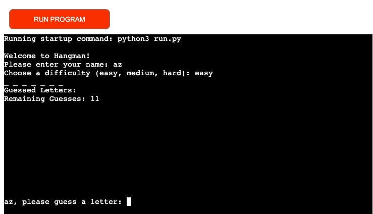

Welcome,

This is the Code Institute student template for deploying your third portfolio project, the Python command-line project. The last update to this file was: **May 14, 2024**

## Reminders

- Your code must be placed in the `run.py` file
- Your dependencies must be placed in the `requirements.txt` file
- Do not edit any of the other files or your code may not deploy properly

## Creating the Heroku app

When you create the app, you will need to add two buildpacks from the _Settings_ tab. The ordering is as follows:

1. `heroku/python`
2. `heroku/nodejs`

You must then create a _Config Var_ called `PORT`. Set this to `8000`

If you have credentials, such as in the Love Sandwiches project, you must create another _Config Var_ called `CREDS` and paste the JSON into the value field.

Connect your GitHub repository and deploy as normal.

## Constraints

The deployment terminal is set to 80 columns by 24 rows. That means that each line of text needs to be 80 characters or less otherwise it will be wrapped onto a second line.

---

Happy coding!

# Hangman

welcome to the hangman game, this game serves as both an educational tool and a source of entertainment. It can help users enhance their vocabulary and spelling skills in a fun and engaging way. The game targets students, educators, and casual users. It is designed to be user-friendly and accessible, making it suitable for various educational settings and leisure activities.

## Design

## Features

- Multiple difficulty levels: Easy, Medium, and Hard.
- Random word selection based on chosen difficulty.
- Visual diagram of the hangman state.
- User-friendly prompts and input validation.
- Option to restart the game after winning or losing.
- Error handling for user input.

## How to play

1. Enter your name, which must be characters and below 11 characters.
2. Type the difficulty level you would like to play.
3. Try and guess the letters in the word.
4. Win if you can guess the letters before the hangman completes.

## Gameplay

## Delpoyment
There are no changes to requirements.txt as no additional dependencies are needed. A Heroku app named 'pp3-hangman' has been created. Configuration variables have been set, and Python and Node.js build packs have been added. The app is connected to GitHub, and manual deployment has been chosen.

## Error handling

The game includes several error-handling mechanisms to ensure a smooth user experience:

- Invalid Name Input: If the user enters a name that is not purely alphabetical or exceeds 10 characters, they will be prompted to enter a valid name.

- Invalid Difficulty Level: If the user chooses a difficulty level that is not one of the specified options (easy, medium, hard), they will be prompted to choose again.

- Invalid Guess Input: If users input anything other than a single alphabetical character for their guess, they will be prompted to enter a valid guess.

- Duplicate Guesses: If the user guesses a letter already used, they will be informed that the letter has already been guessed.

## Bug 
- Issue with collecting user guesses and not displaying wrong and correct guesses.

- Issue with showing hangman state once user loses.

## Credits

- Thanks to Grammarly for correcting and improving the readability of the READ.md
- Thanks to oxfordowl.co.uk for providing an easy and medium word list tailored towards year 6 and year 6 students.
- Thanks to Codeinsitiute for providing the original template.